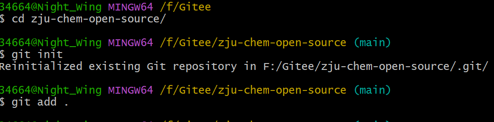
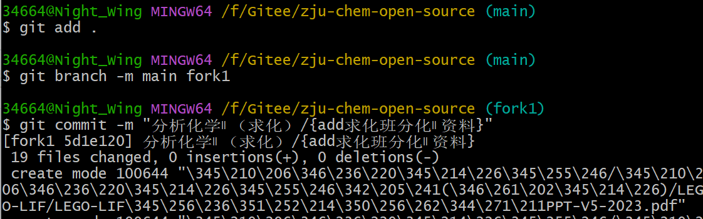
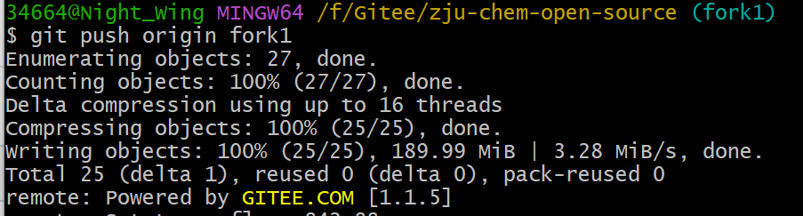
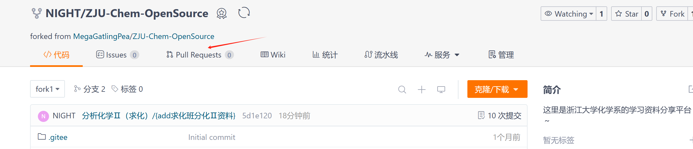

# 记录一下命令行contribute的命令

## 首先fork原有的仓库

创建自己的分支，可以添加一个课程名称命名的分支

## clone仓库到本地

挑选一个文件夹（比如我的目录是F:/Gitee/）

右键，'open Git Bash here'，命令行：
```shell
git clone https://gitee.com/zju_5_0/zju-chem-open-source.git
```
（你自己fork下来的那个仓库查到的clone命令）


然后可以添加pdf，or用编辑器添加一些文件什么的完成修改

## 初始化git仓库
进入pull下来的文件夹

```shell
cd zju-chem-open-source
```
初始化
```shell
git init
```
添加文件到git仓库
```
git add .
```


## 切换到新建的分支并commit到记录中

在本地对git文件夹中的文件进行修改后，还需要再add一次
```shell
git add .
```
切换到新建的分支
```shell
git branch -m main fork1
```
然后commit
```shell
git commit -m "分析化学Ⅱ（求化）/{add求化班分化Ⅱ资料}"
```


## 推送到远程仓库

```shell
git push origin fork1
```


## 创建Pull Request




